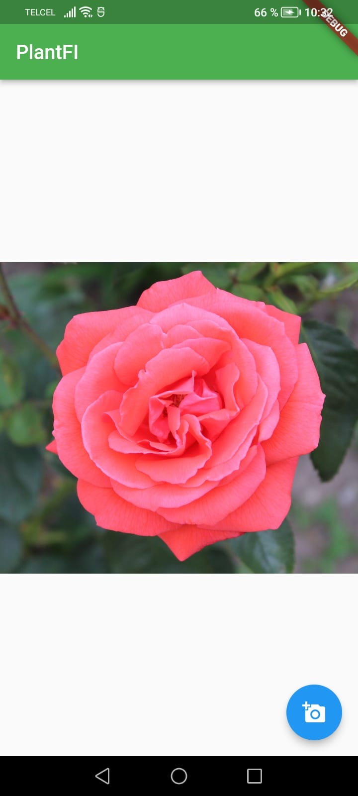

# plantfi_v1

Nuestro Flutter project llamado PlantFi se encargará de que cualquier usuario pueda descubrir cuál es la planta que está viendo, por medio de una aplicación móvil el usuario tan solo tendrá que tomarle una foto y así poder descubrir de que planta se trata para que por su cuenta busque el como cuidarla o cuáles son las mejores indicaciones para su crecimiento.

## Getting Started

This project is a starting point for a Flutter application.

A few resources to get you started if this is your first Flutter project:

- [Lab: Write your first Flutter app](https://docs.flutter.dev/get-started/codelab)
- [Cookbook: Useful Flutter samples](https://docs.flutter.dev/cookbook)

For help getting started with Flutter development, view the
[online documentation](https://docs.flutter.dev/), which offers tutorials,
samples, guidance on mobile development, and a full API reference.

Con TensorFlow nosotros entrenamos nuestra ia la cual nos brinda un archivo .tflite el cual por medio de nuestro framework hacemos uso de el para asi poder obtener el output depues de mandarle la foto como el input.

En la foto que vemos en la parte de abajo podemos apreciar un poco del como se está viendo nuestra app, en la cual el usuario toma una foto o también tendrá la opción de subir una de su galería y una vez que mande el input el output que recibirá el usuario será la respuesta del nombre de la planta.

